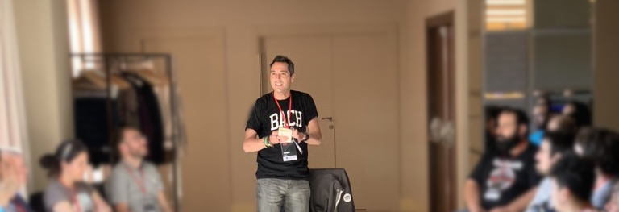
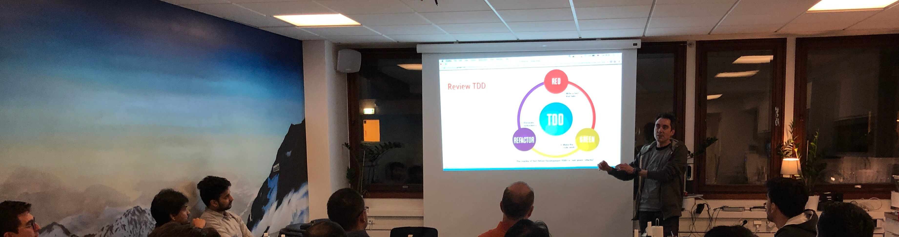

BIG NEWS! 🎉 After some weeks of self-care, I feel ready to start searching for a new professional challenge preferably as an **employee** (only in exceptional cases as a **contractor**, but I don't feel like freelancing with several companies at the moment) at a **product company** as a preference.
Being **full-remote** is a MUST (no problem to move for on-sites every quarter or so) and I will say it despite being taboo: aiming for a **"high salary"** right now (in the "North-Europe" range, whatever that means; just keep reading and let's talk about it anyway 😉).

**Doing what?** Basically, I can help your organisation and teams in the continuous and sustainable delivery of value for your users/customers/business through **software and product development**, with a diverse set of values, principles and practices (both social and technical, mostly grown around Lean Software Development, eXtreme Programming, DevOps culture, NVC, etc.), lowering the pain at the same time. We would do it together (I don't want to feel alone, I want peers). Let's grow **TOGETHER**.

**For what position?** Well... it depends (sorry not sorry). Labels are too contextual and subjective and I don't care much about them; some might be "Technical Agile Coach", "Senior/Staff/Whatever Software Engineer", "Product Developer", "Enabler", "Tech Lead" or "Minion" (it really depends on the context and conditions).

Having said that, my preference is a position with serious leverage, where I could feel that I have a positive impact in a broad scope.

Please, read the rest of this writing and if you feel that our needs and interests might be aligned, just contact me 🙏

    

## A little bit about my experience and vision

I have lived and worked in different countries (France, Spain, Germany, Sweden, UK), and sometimes with **REALLY diverse and multicultural environments** (special mention for Spotify in Stockholm). So, I have a lot of experience with "cultural differences"...
At the same time, I have been lucky enough to work in **many different industries**: research centers, public administration, social networks, music, consultancy, fintech, telecommunications, startups, scale-ups, etc. And I have experience in several companies/teams working in **distributed teams**.

I think that **product/software development is a learning journey**, a double one indeed: we need to learn **WHAT** to do (what is the problem, the user/customer need to solve?) and **HOW** to do it. I approach it creating **fast feedback loops** (both for the **user/customer/business needs**, for the systems/technology and for the people working on it), working at a **sustainable pace**, with an eye to **simplicity** (both for the product and for the technology, reducing "waste" and maximizing the work not done), keeping **focus** ("stop starting, start finishing"), taking lots of **baby steps**, growing an **experimentation and learning culture**, with a strong **automation** view (for testing, deploying and any other error-prone/boring/repeated task). For succeeding in that, we need **empowered and self-organised teams** who contain all the required skills to fulfill their mission in an **end-to-end** way (from product discovery to the final satisfaction of the user needs - whoever they are -, maintenance included); teams with **continuous learning and improvement** habits, with healthy habits and pragmatic decisions. All that within an **aligned organisation** with clear **focus** and growing a **psychologically safe** culture where people work together, they **care for each other**, having **fun**, trusting and feeling listened and valued as **human beings**.

And always based on a very fluid and **honest communication** among all the people involved in the mission, being able to express ourselves in an **empathetic** and assertive way (the [Non-Violent Communication](https://www.nonviolentcommunication.com/) approach can help with that). I'm also a fan of **over-communicating** (specially as a geographically distributed team): most of our problems come from the [illusion of communication](https://philosiblog.com/2012/01/06/the-single-biggest-problem-in-communication-is-the-illusion-that-it-has-taken-place/), not from the technical space.

Some of my biggest satisfactions so far were **being part of growing teams where only a few minutes/hours/days elapsed from the moment we started working on a user need and that user need was (starting to be) satisfied**. All that based in many values, principles and practices, besides the previously mentioned: **vertical slicing** (for business and technology), measuring the impact, [DDD](https://martinfowler.com/bliki/DomainDrivenDesign.html), pair/ensemble working by default, Outside-In TDD by default, refactoring mercilessly, [Trunk-Based Development](https://www.youtube.com/watch?v=UvtaujgCNsI), self-managed and self-organised teams, simplicity (yes, again), focus (limiting WIP), encouraging a **continuous and sustainable flow**, lots of **automation**, **end-to-end ownership** (software, infrastructure, observability, etc.), **humility**, **transparency**, **empathy**, **trust**, **fun**, **respect**, **courage**, etc. And we did it surrounded by **GOOD people** doing their best to do **the right thing in the right way** in a flat structure and being a remote/distributed team (I had started working fully remote before the COVID).

The best teams where I have worked (according to the [DORA report](https://cloud.google.com/blog/products/devops-sre/announcing-dora-2021-accelerate-state-of-devops-report), some people would call them "highly effective" or "high-performing" - even "elite", which I detest) looked like being very **"calm" and "smooth"** from the outside: seldom in emergency mode. And they worked TOGETHER (pair/ensemble by default), not as cowboys/cowgirls. That's the kind of team/culture I aim at growing and being part of.

If the previous blocks resonate to you, we might be a good match 🤩

I would LOVE to work at a company with an AMAZING mission, having a voice and feeling that I can make a difference surrounded by nice and professional people. Bonus points if it existed the chance to work less than 40 hours per week at some point in the future 👐

For further details, you can take a look at [my LinkedIn profile](https://www.linkedin.com/in/islomar/) or some of my [talks and workshops](my-talks-and-workshops.md) (I like sharing) 🤓

## My references

### Some people from whom I have learnt or I keep on learning

- **Disclaimer**: they are not enlightened Buddhas. Nobody is a Being of Light. I don't idolize or idealize anybody. It's just some of the people from whom I have been able to learn a lot because of their, at some point in time, unique or special perspectives about product/software development in the most holistic sense (people, organizations, teams, companies, principles, techniques, technology, etc.). Not all of the "required" are here, but the ones that are here, are "required".
- Some interesting people who have inspired me (random order): [Charity Majors](https://charity.wtf/), [Kent Beck](https://twitter.com/KentBeck), [Martin Fowler](https://martinfowler.com/), [Liz Keogh](https://lizkeogh.com/), [Bob Marshall](https://flowchainsensei.wordpress.com/), [Eduardo Ferro](https://www.eferro.net/), [Marty Cagan](https://svpg.com/), [Jessica Kerr](https://jessitron.com/), [Uncle Bob](http://cleancoder.com/), [Woody Zuill](https://woodyzuill.com/), [Sandi Metz](https://sandimetz.com/), [Seth Godin](https://seths.blog/), [Sandro Mancuso](https://twitter.com/sandromancuso), [Donella H. Meadows](https://donellameadows.org/), [Carlos Blé](https://www.carlosble.com/), [Jez Humble](https://twitter.com/jezhumble), [Melissa Perri](https://melissaperri.com/), [GeePaw Hill](https://www.geepawhill.org/), [Julia Evans](https://jvns.ca/), [Bob Allen](https://twitter.com/CuriousAgilist), [Allen Hollub](https://holub.com/), [Sarah Mei](http://www.sarahmei.com/blog/about/), [Dave Farley](https://www.davefarley.net/), [Ron Jeffries](https://www.ronjeffries.com/), [Emily Bache](https://twitter.com/emilybache), [Gojko Adzic](https://gojko.net/), [Xavi Gost](https://twitter.com/XaV1uzz), [Taiichi Ohno](https://en.wikipedia.org/wiki/Taiichi_Ohno) and many others...

### Other stuff that has inspired me a lot at some point of my professional life

Systems thinking, Lean product development, eXtreme Programming, [agile](https://agilemanifesto.org/), Kanban, the Software Crafters community, DevOps culture, Continuous Delivery mindset, Domain-Driven Design, Non-Violent Communication, Real Options, Buddhist meditation, Social and Cultural Anthropology, Psychology, the scientific method and many books etc.

### My readings

[Here](https://www.goodreads.com/islomar) you can take a look at some of the "many" books that I have read (or currently reading). There, you can see all my bookshelves and take a look at whatever you feel an interest in (e.g. product development, teams, software development, etc.)
I love reading and I think it's one of the main ways to open your mind and learn new things (other ways of achieving it are "hands-on" activities, **deliberate learning** and keeping good and curious people around you).

## You might be interested to hire me if...

- It's taking longer and longer for you to **deliver value to your users**. Or just longer than you need or would like to. I can help you to move to a delivery of value several times per day.
- It's getting too painful to **change/understand your codebase** and to **take it to Production**: your legacy code is eating you and you have too many manual steps!
  - I can help you introduce Infrastructure as Code; during my time as a Platform Engineer I dealt a lot with Terraform, Docker, AWS, etc. (I'm not an "expert" though)
  - Your commits _should_ experience a smooth and automated flow to Production.
- Your **issues in Production** are taking "too much time" from thinking and experimenting what to solve and how to solve it. And even worse: they are damaging your users trust! (and probably your developers morale).
- Your **feedback cycles** are too slow. For example, your lead time from commit to production usually takes days instead of minutes. That is to say you learn very slowly... I would encourage fast feedback cycles through practices like TDD, pair/ensemble programming, trunk-based development, feature flags, robust delivery pipelines and many other things. We would go there in baby steps 😊
- You don't see how you could improve your **technical skills** to better serve the users/business (and for having a better life).
- You would like to get rid of those **diabolic long-lived branches** and hellish pull-requests but you don't know how to get the same value without their drawbacks. I can help you to move to a Trunk-Based Development approach in a safe way.
- You want to start writing **automated tests** (unit, integration, end-to-end, performance) but you don't know how. Or you are already doing it but you want to improve.
- You see value in **TDD** but don't know how to do it.
- Your design/architecture is getting too difficult to understand and change. I can help with many different "tools", e.g. with Domain-Driven Design principles and practices.
- Your **engineering culture** is focused on technology and not so much on finding out what is the right problem to solve in small steps (not burning people in the path). I can bring a **socio-technical approach** caring about people at the same time, supporting them to grow as professionals (as a team and as individuals).
- You would like to start **decoupling "release" from "deployment"**, so that you could get fast feedback from the system (e.g. with feature flags and other parallel changes techniques).
- You have lots of **blocking dependencies in your Value Stream** but you are not sure about how to reduce them (both human and technological).
- You don't know how to **simplify and split your "user stories"** (or whatever you call it), you are more focused on getting (better) estimations. I can help you with your product management and focusing on getting a continuous flow of value instead of "wasting efforts" on "traditional" estimations.
- I can help you foster a **continuous learning culture**, which is both good for your business and for your people's motivation!
- And many other topics: hiring, onboarding, general developer experience, incident management, teams organisation, etc.

    

## Please, don't hire me if...

- Don’t hire me if you deliberately lie or hide important information to your users, customers, employees, providers or any other stakeholder. Also if you want to create or reinforce any kind of addiction in people or you're consciously hurting human or animal lives. **Ethics** are extremely important to me (at the same time I'm human, so I'm full of cognitive dissonances and incoherences). Here you can read about [my ethical stance](/blog/my-ethical-stance).
- There is no **SERIOUS psychological safety**: there are agrgressive people who diminish other people opinions, either directly attacking them or putting them down (sometimes in "subtle" ways). Extra red flags if the people doing it are the CxO/VP/HeadOf, I've had enough of that 🙏
- You are looking for a **"technology expert"**: someone who should be the technical reference for technology A or B. That's neither what I want to do nor where I can bring more value. On the bright side: I can help you get to [T-shaped roles](https://www.forbes.com/sites/lisabodell/2020/08/28/futurethink-forecasts-t-shaped-teams-are-the-future-of-work/?sh=4882c3fc5fde) and minimize the **knowledge silos**.
- You need me to be **on-call outside of business hours** "too often". During my last experiences on-call I suffered from a serious [burnout](https://twitter.com/islomar/status/1228645835057045504); besides that, it's clear to me that I don't want it at this point of my life. On the sunny side: I know from experience that you can have a [healthy on-call policy](https://twitter.com/islomar/status/1438447018582724611) where not everybody HAS TO be on-call and where alerts very seldom happen. I can help you with that 😉 (I would be open to try it for a few days and better understand your process in order to improve it).
- Working **over-hours** is not an extremely rare thing to do (and when done, it is compensated). No meetings outside the "core working hours". I feel passion for my work, but I feel even more passion for my time out of work. Good news: I can help you achieve a much healthier culture (if you want) 🙏
- You don't like people who ask **"why" and "what for"** a lot and you just want someone to tell them what the problem is and even sometimes how to solve it: I'm sure you can get cheaper people for doing that 😄
- **Command and control** is the main way you take decisions (even if they are coloured with fancy names).

## Some questions that I will probably ask you
Because of the general interest, I have moved this section to an independent [post](../blog/some-interview-questions-as-interviewee/).

## Final words

Congratulations!! 🎉 You arrived at the end of this (not so short) description about what I think I can offer and what I would need. If you think we could be a good match, just contact me and let's talk! 🙏
